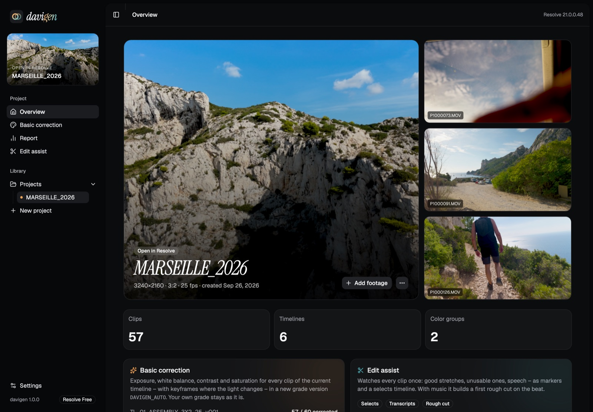
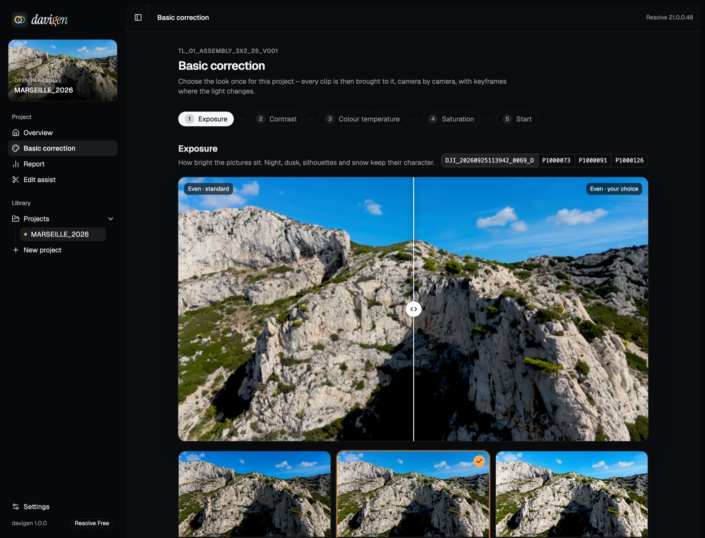
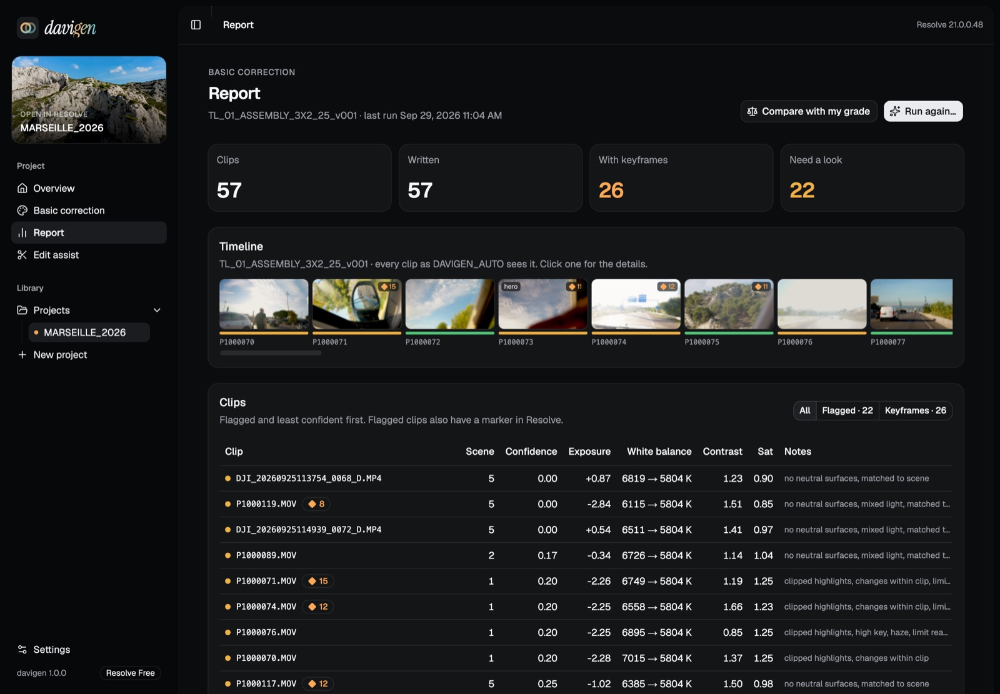

# davigen

**Set up a DaVinci Resolve project the same way every time – and keep it in order while you work on it.** You
enter a name and point davigen at your cards. It then creates:

- the folder structure on disk, with your files moved (or copied, or linked) into it safely
- the Resolve project with every setting in place – frame rate and playback frame rate, resolution, color
  management, and every working folder (proxies, cache, gallery) inside the project folder
- media bins with every file sorted: camera clips, stock, photos, graphics, music, voice-over, sound effects
- timelines with named tracks
- a color group for each camera and log profile, with the input and output transforms already in place
- render presets for every delivery format

Anything you add later – a second card, stock footage, a song, a logo – goes the same way and to the same places,
and nothing davigen already did is done again.

davigen runs from Resolve's own **Workspace → Scripts** menu and works in **Resolve Free** and **Studio**.
It started as a personal travel-video workflow (Panasonic S1II 6K open gate in V-Log plus a DJI drone in D-Log M,
delivered as a 3:2 master, 16:9 for YouTube and 9:16 for Reels). Those are still the defaults, and
you can change every one of them.

```bash
curl -fsSL https://raw.githubusercontent.com/tetrxs/davigen/main/install.sh | zsh
```

Then restart Resolve and choose **Workspace → Scripts → davigen**.



On top of the setup, two actions you can run on new files right away or on everything later:

- **Basic correction** brings exposure, white balance, contrast and saturation of every clip to one look you
  choose once – with keyframes where the light changes within a shot – in its own grade version, so your grade
  stays untouched.
- **Song markers** put markers to cut on onto every song, each kind in its own colour: bars, phrases and parts,
  accents, and (estimated) vocal entries. Plain signal analysis on your Mac – no AI model, nothing downloaded.

| Choose the look | See what was done, clip by clip |
| --- | --- |
|  |  |

---

## Contents

- [What it does](#what-it-does)
- [Install, update, uninstall](#install-update-uninstall)
- [Using davigen](#using-davigen)
- [The color pipeline](#the-color-pipeline)
- [Cameras and log profiles](#cameras-and-log-profiles)
- [Bringing files in safely](#bringing-files-in-safely)
- [Resolve versions, Free and Studio](#resolve-versions-free-and-studio)
- [Customizing the standard](#customizing-the-standard)
- [Privacy and network access](#privacy-and-network-access)
- [Troubleshooting](#troubleshooting)
- [Development](#development)
- [License](#license)

The day-to-day editing guide (which timeline is for what, how to grade, how to deliver) is in
**[docs/WORKFLOW.md](docs/WORKFLOW.md)**.

## What it does

| Step | Result |
|---|---|
| **Scan** | Looks at every file: camera clips get make, model, resolution, frame rate, bit depth, lens and log profile from their metadata (exiftool, Panasonic/Sony XML sidecars, DJI lens IDs) and are grouped by camera + profile; every other file is recognised as stock video, photo, graphic, logo, music, voice-over, sound effect, LUT, font or document – you can change each. |
| **Folders** | `ITALY_2026/00_ADMIN … 05_EXPORTS, 99_ARCHIVE` with one `01_MEDIA/NN_<CAMERA>` folder per camera, `01_MEDIA/9x_…` for audio, stills and stock, `04_ASSETS/…` for music, effects, graphics, logos, fonts and LUTs. |
| **Files** | Moves, copies or links every file to its place – checksum-verified and put back automatically on any failure. Audio that isn't 48 kHz PCM gets a 48 kHz WAV next to it (a 44.1 kHz FLAC crackled in Resolve), images Resolve can't read (SVG, AVIF) a PNG. |
| **Project** | Resolve project in `VIDEO_PROJECTS/ACTIVE` with frame rate **and playback frame rate**, resolution, DaVinci YRGB color management (DaVinci Wide Gamut / Intermediate timeline, Rec.709 Gamma 2.4 output), proxy settings, render cache, and the proxy, cache, project media and gallery folders inside the project folder. |
| **Bins** | `01_FOOTAGE/<CAMERA>`, stock, stills, selects, timelines, audio (music, VO, SFX), graphics, logos, PowerGrades … Clips get a clip color and keywords, and the camera and profile are written to their metadata. |
| **Timelines** | `TL_01_ASSEMBLY` holds all clips in shooting order. `TL_02_EDIT` and `TL_03_MASTER` are at master resolution. There is one `TL_0N_DELIVERY_…` timeline per extra delivery format. Every timeline has named tracks. |
| **Color** | One color group per camera and profile (`G_LUMIX_S1II_VLOG`, `G_DJI_AIR3_DLOGM`). **Group Pre-Clip** turns the camera log into DaVinci Wide Gamut. **Group Post-Clip** turns that into Rec.709 with DaVinci tone mapping. Each clip gets six labelled, empty nodes (`01_EXPOSURE … 06_FINISH`). |
| **Basic correction** | Measures every clip (rendered by Resolve itself, in the working space) and fills `01_EXPOSURE … 04_SATURATION` with exposure, white balance, a real black point and saturation, matched per scene and across cameras. Where the light changes inside a clip (a tunnel, a cloud, shade to sun) it writes keyframes. Everything goes into a grade version `DAVIGEN_AUTO`; your own grade is never touched. Unsure clips get a marker, and the report shows every clip before and after, with what was measured and why. See [docs/WORKFLOW.md §5](docs/WORKFLOW.md#5-grading). |
| **Song markers** | Markers on the song itself, so they show wherever it is used: bars (cyan), phrases every 4 bars and the song's parts as ranges (purple), accents that stand out from the beat (yellow), vocal entries (pink, estimated). davigen replaces only its own markers. |
| **Deliver** | Render presets and output folders for the master (ProRes 422 HQ), 16:9 UHD (H.265) and 9:16 1080 (H.264), with 16:9 HD, 4:5 and 1:1 as options. The whole set can be queued with one click. |

The home screen also looks after the project that is open in Resolve:

- **Add files:** new cards, stock, photos, songs go through the same steps as at the start – into the same
  structure and bins, new clips to the end of the assembly timeline. Files already in the project are recognised
  (by content, not by name) and left as they are.
- **Assets:** every file of the project with what davigen has done to it; apply Basic correction or song markers
  to everything that needs it, or to a selection. A clip you delete in Resolve is noticed and left alone.
- **Assign groups & nodes:** use it after you build new timelines. Resolve stores groups and grades per timeline clip.
- **Refresh color:** rebuilds every group's transforms, for example after you add a missing LUT.
- **Queue renders:** adds every delivery to the render queue.

The home screen also lists recent projects, with **Open in Resolve**, **Show in Finder** and **Delete** (the Resolve
project and its whole folder go to the Trash, with a last export inside, so *Put Back* restores everything).

Everything davigen does runs as one **pipeline**: the steps are built from what you chose and what is really left
to do, each shows *n of m*, a bar and the time left, and a step that needs a choice (the look, the marker kinds)
waits for it. How it works: [docs/concepts/PROJECT_PIPELINE.md](docs/concepts/PROJECT_PIPELINE.md).

## Install, update, uninstall

**Requirements:**

- macOS 13 or later, on Apple silicon or Intel
- DaVinci Resolve 18.5 or later. Version 19 or later is recommended, and development happens on 21.

Nothing else is needed: no system Python and no Docker. For converting audio and for song markers davigen uses
[ffmpeg](https://ffmpeg.org) if it is installed (`brew install ffmpeg`); everything else works without it.

```bash
curl -fsSL https://raw.githubusercontent.com/tetrxs/davigen/main/install.sh | zsh
```

Everything lives in **one folder, `~/Applications/davigen`**:

```
~/Applications/davigen/
├── davigen/          the app (Python + a small local web UI)
├── config/           your standard: folders, bins, timelines, deliveries, log profiles, cameras
├── templates/drx/    node templates
├── runtime/          private Python 3.14 (python-build-standalone) + colour-science, exiftool
└── data/             settings, project list, camera catalog, LUTs – yours, kept on update
```

Outside that folder the installer writes only three things:

| What | Where | Why |
|---|---|---|
| Menu entries | `~/Library/Application Support/Blackmagic Design/DaVinci Resolve/Fusion/Scripts/Utility/davigen.py` and `davigen Basic Correction.py` | make davigen appear under Workspace → Scripts |
| LaunchAgent | `~/Library/LaunchAgents/com.davigen.python.plist` | sets `PYTHON3HOME` at login, so Resolve can find davigen's Python |
| LUTs | `/Library/Application Support/Blackmagic Design/DaVinci Resolve/LUT/davigen/` | the input and output transforms the color groups use |

**Update:** *Settings → Update now* in davigen, or run the same one-liner again. Both replace the code and keep
`data/` and `runtime/`; start davigen again afterwards.

**Uninstall:**

```bash
~/Applications/davigen/uninstall.sh
```

This removes the menu entry and the LaunchAgent, and moves the folder to the Trash. Add `--keep` to leave the
folder where it is. Add `--purge` to also remove the LUTs; your existing projects need them, so they stay by default.

**Portable:** the folder is self-contained. To use it on another Mac, copy it there and double-click
`install.command`.

## Using davigen

Open Resolve, then choose **Workspace → Scripts → davigen**. A browser window opens.

> **"davigen isn't running"**: the page talks to a small helper that runs inside Resolve. It stops when Resolve
> quits, or 10 minutes after you close its window. To bring it back, choose **Workspace → Scripts → davigen** again. A fresh window
> opens and the old one can be closed.

**New project** has five steps:

1. **Project:** the name (normalized to `ITALY_2026` style) and a location. The default is `~/Movies/davigen`.
2. **Files:** add cards, folders or single files, then scan. How they come into the project – move, copy, link
   or leave – is a davigen setting, the same for every import.
3. **Assets:** check the detected profile for each camera. It shows where the input transform will come from,
   and how sure the detection is: *from metadata*, *inferred* or *guessed*. Every other file is listed with its
   kind, which you can change or leave out.
4. **Format:**
   - aspect ratio (3:2, 16:9, 17:9, 4:3, 2.39:1, 9:16, 4:5, 1:1 or custom)
   - master resolution, from a preset or custom width × height
   - frame rate
   - deliveries

   davigen suggests the format of your footage. It warns about frame-rate mismatches, for example 59.94 fps drone
   clips in a 25 fps project. In Resolve Free it shows the resolution the project will get.
5. **Start:** the optional actions – **Basic correction** (with its look) and **Song markers** (with their kinds) –
   and a summary of folders, timelines, groups and deliveries before anything is created.

You then follow the run step by step. **Add files** on the home screen is the same without steps 1 and 4.

Proxies are made in Resolve when you want them (Media Pool → select clips → right-click → *Generate Proxy Media*):
davigen has set their resolution and pointed them at `03_WORK/PROXIES`, so they land in the project.

**Basic correction** on the home screen (or **Workspace → Scripts → davigen Basic Correction**) runs the same
first pass on the timeline that is open in Resolve, with a report of every clip: click one for its before and after,
the measurements, the values written, the reasons, and the exposure over the clip with its keyframes.

## The color pipeline

```
clip ─▶ Group Pre-Clip ─▶ Clip ─────────────────────────────▶ Group Post-Clip ─────────────▶ Timeline
        input transform    01_EXPOSURE  02_WHITE_BALANCE      [your look nodes]
        camera log → DWG   03_CONTRAST  04_SATURATION         output transform
                           05_SECONDARIES  06_FINISH          DWG → Rec.709 2.4 (DaVinci TM)
```

- **Working space:** DaVinci Wide Gamut / DaVinci Intermediate. Grades behave the same on every camera, and
  footage from different cameras matches.
- **Group Pre-Clip** holds the camera's input transform as a LUT. Resolve's scripting API can only place LUTs in
  group graphs, not build CST nodes, so davigen bakes the transform and loads the result.
- **Clip:** six empty, labelled serial nodes where you grade each shot. davigen only adds them to clips that have
  no grade yet, so it never overwrites your work.
- **Group Post-Clip:** the output transform (DWG → Rec.709 Gamma 2.4, DaVinci tone mapping). Add look nodes
  (film emulation, creative LUTs) *before* it.

Where each input transform comes from, in this order:

1. **Resolve's own Color Space Transform.** If your Resolve has the log curve and gamut, davigen writes a CST
   node from a template, applies it to a scratch clip and exports a 65-point LUT. The result is exactly what a CST
   node would do.
2. **Published formula.** If Resolve lacks the curve, the LUT is computed from the manufacturer's published math
   with [colour-science](https://www.colour-science.org/). Panasonic V-Log matches Resolve's CST to within 3·10⁻⁵.
3. **The manufacturer's official LUT.** Some profiles have no public formula, such as DJI D-Log M. With online
   sources allowed, davigen finds the LUT for your exact camera model in the manufacturer's download catalog and
   downloads it once. It then combines it with Resolve's Rec.709 → DWG, so the group still ends in DWG.
4. **Your LUT file.** If none of the above is available, the home screen asks for a `.cube` file for that group.

Generated LUTs are cached in Resolve's LUT folder and in `data/luts`, so later projects reuse them.

## Cameras and log profiles

**Built-in profiles:**

- Panasonic V-Log
- Leica L-Log
- Sony S-Log3 (S-Gamut3.Cine / S-Gamut3) and S-Log2
- Canon Log 2 and 3
- Fujifilm F-Log, F-Log2 and F-Log2 C
- Nikon N-Log
- DJI D-Log and D-Log M
- GoPro GP-Log2, GP-Log and Protune
- Insta360 I-Log
- Apple Log, Samsung Log, Xiaomi Mi-Log and Filmic Pro Log
- Blackmagic Film Gen 5
- ARRI LogC3 and LogC4
- RED Log3G10
- HLG and plain Rec.709

The profiles are listed in [`config/profiles.toml`](config/profiles.toml).

**Camera detection:** make and model come from the file metadata. The profile comes from metadata where the
camera writes it, for example Panasonic and Sony. Otherwise it is inferred from the brand and
the recording format, and you confirm it in the Cameras step.

**Camera catalog:** about 900 camera models with photos, loaded from [Wikidata](https://www.wikidata.org) and
[Wikimedia Commons](https://commons.wikimedia.org). It refreshes about once a year. A camera the catalog doesn't
know can be added by hand, and davigen remembers it (`data/user_cameras.json`).

## Bringing files in safely

How files come into the project is set once in davigen's settings and used for the setup and every later import:

| Mode | In the project folder | The original |
|---|---|---|
| **Move** (default) | the file | moved |
| **Copy** | a checked copy | stays |
| **Link** | a link at the file's place, e.g. `01_MEDIA/01_LUMIX_S1II/2026-09-25_DCIM/P1000075.MOV` | stays where it is, e.g. on the card |
| **Leave in place** | nothing | stays, imported from there |

**Link** keeps the project folder complete without using space. Resolve knows only the path inside the project, so
with the card plugged back in everything is online again without relinking, and *Collect linked files* on the
Assets page later replaces the links by the files themselves – Resolve doesn't notice.

**Move** is the default, so a 5 TB shoot doesn't need another 5 TB of free space.

- **Same drive:** each file is renamed into the project folder. This is instant and uses no extra space.
- **Another drive:** each file is copied to a temporary `.part` file, fsynced, re-hashed and compared with the
  original. Only then does it take its final name, and only then is the original removed.
- **Sidecar files** (`.XML`, `.LRF`, `.SRT`, …) travel with their clip.
- **Nothing is overwritten.** If a name already exists, the run stops before touching anything.
- **Every step is recorded in a journal** (`00_ADMIN/PROJECT_INFO/transfer_*.json`, `runs/`) before it happens:
  - Bringing files in and importing them is one transaction: if a step fails (Resolve refuses a file, a full
    disk), every file goes back where it was, partial copies are removed and nothing half-imported stays in the
    Media Pool.
  - If Resolve crashes, the Mac shuts down or you quit mid-transfer, the next davigen start undoes the unfinished
    import and tells you on the home screen.
  - Actions after that (Basic correction, song markers) keep what they finished; the next run does exactly the rest.

## Resolve versions, Free and Studio

davigen asks Resolve what it can do and adapts:

| | Free | Studio |
|---|---|---|
| Runs from Workspace → Scripts | ✓ | ✓ (from a terminal as well) |
| Master resolution | up to UHD. A 6K 3:2 master becomes 3240 × 2160; the Format step shows this. | any |
| Everything else | ✓ | ✓ |

| Resolve | What happens |
|---|---|
| 21 | Everything. This is the version davigen is developed on. |
| 19 – 20 | Everything. Group pre- and post-clip graphs have been scriptable since 19. |
| 18.5 – 18.6 | Folders, project, bins, footage, timelines, groups and deliveries work, and the LUTs are generated. Adding them to each group's pre- and post-clip graph is a manual step; davigen lists which LUT goes where. |
| older | Not supported. The scripting API lacks color groups. |

Resolve loads davigen's Python through `PYTHON3HOME`. Older Resolve versions may not load Python 3.14. In that
case, install with an older Python:

```bash
curl -fsSL https://raw.githubusercontent.com/tetrxs/davigen/main/install.sh | DAVIGEN_PYTHON=3.12 zsh
```

## Customizing the standard

Everything that makes up "the standard" is plain TOML in `config/`:

- **`workflow.toml`**
  - default frame rate, aspect ratio and transfer mode
  - resolution presets and project settings
  - folder tree, bin tree, timeline names and track names
  - deliveries: codec, resolution, output folder and file name
- **`profiles.toml`**: log profiles, their Resolve CST names or formula, and where to find vendor LUTs.
- **`cameras.toml`**: brands, and known cameras with their possible profiles.

Updates replace `config/`. To keep your own standard across updates, keep a copy of your edits.

## Privacy and network access

davigen runs locally. Its web UI listens only on `127.0.0.1`, behind a random per-session token.

It uses the internet only in these cases:

- **Installation:** Python, colour-science and exiftool, from GitHub, PyPI and SourceForge, checksum-verified
  where the project publishes checksums.
- **Online sources**, only after you allow them on first start:
  - the camera catalog, from the Wikidata query service and Wikimedia Commons thumbnails
  - manufacturer LUT catalogs, currently DJI's public download center
Nothing about your footage or projects leaves your Mac.

## Troubleshooting

| Problem | Fix |
|---|---|
| **davigen doesn't appear under Workspace → Scripts** | Quit and reopen Resolve after installing. Resolve scans the menu folder when it starts. |
| **Clicking davigen does nothing** | Resolve didn't find Python. Run `launchctl getenv PYTHON3HOME`: it should print a path inside your davigen folder. If it doesn't, run the installer again, then restart Resolve. In the Fusion page console (Workspace → Console), Python errors appear under *Py3*. |
| **"davigen isn't running" in the browser** | Start it again from the Scripts menu. See [Using davigen](#using-davigen). |
| **A group has no input transform** | The home screen shows why. The fix is either *Allow online sources* or *Choose LUT file…*, followed by *Refresh color*. |
| **Renders look ungraded on a new timeline** | Run *Assign groups & nodes*. Resolve keeps group membership per timeline clip. |
| **Playback frame rate is wrong** | Resolve's API can't set it, so davigen creates new projects from a project template it makes itself, with the right playback frame rate. Projects made by an older davigen: Project Settings → Master Settings → Playback frame rate. |

## Development

```bash
git clone https://github.com/tetrxs/davigen && cd davigen
./install.sh                               # sets up runtime/ and points Resolve at this checkout
python3 -m venv .venv && .venv/bin/pip install pytest pyflakes -r requirements.txt
.venv/bin/pytest                           # unit tests (Resolve isn't needed)
.venv/bin/python scripts/dev_server.py --open   # the UI against a fake Resolve
```

The UI is a React app (shadcn/ui on Base UI, Tailwind) in `web/`. It builds into `davigen/ui/`, which is committed,
so installing davigen needs no Node:

```bash
cd web && npm install && npm run build     # rebuilds davigen/ui/
npm run dev                                # hot reload; /api is proxied to a davigen on port 8765
```

- Scanner tests against real footage run when `DAVIGEN_SAMPLE_FOOTAGE` points to a folder of clips.
- `scripts/scrub_drx.py` strips gallery paths and footage thumbnails from a grade still before it goes into
  `templates/drx/`.

**Code map:**

- **`pipeline/`:** everything that happens to a project, as building blocks (`actions/`), the runner that builds
  and runs the steps, the asset record (`assets.py`) and its real state in Resolve (`state.py`)
- **`template.py`:** new projects from davigen's own project template (playback frame rate, proxy folder)
- **`creator.py`:** maintenance flows (refresh color, assign groups, queue renders)
- **`transfer.py`:** journaled moves
- **`formats.py`:** resolutions, timelines, deliveries
- **`color.py`, `transforms.py`, `colormath.py`, `drx.py`:** color pipeline
- **`scanner.py`, `mediainfo.py`:** metadata
- **`catalog.py`:** camera catalog
- **`server.py`:** the local API; **`web/`** its UI (built into `ui/`)
- **`music.py`:** beats, bars, parts, accents and vocal entries of a song
- **`posters.py`, `update.py`, `delete.py`:** project pictures for the UI, the update check, deleting a project

Pull requests are welcome. By opening one, you agree that your contribution is licensed under the terms below.

## License

© 2026 tetrxs. **[CC BY-NC-ND 4.0](LICENSE)**

**You may:**
- use davigen for free, for your own videos, including videos you publish or get paid for
- change it for yourself

**You may not:**
- sell it or use it in a commercial product or service
- publish modified versions
- republish it under another name

Third-party components are downloaded at install time, not redistributed:

- Python ([python-build-standalone](https://github.com/astral-sh/python-build-standalone), PSF license)
- [colour-science](https://github.com/colour-science/colour) (BSD-3-Clause)
- [ExifTool](https://exiftool.org) by Phil Harvey (Perl Artistic License / GPL)
- davigen uses [ffmpeg](https://ffmpeg.org) if it is installed (e.g. with Homebrew); it doesn't ship it

Basic correction's white-balance model (`davigen/basic/models/wb_ccc.npz`) was trained by davigen on the
[SimpleCube++](https://github.com/Visillect/CubePlusPlus) dataset by Ershov et al. (2020), licensed CC BY 4.0. The
method is Convolutional Color Constancy (Barron, ICCV 2015). Its exposure target was fitted on the experts' edits in
[MIT-Adobe FiveK](https://data.csail.mit.edu/graphics/fivek/) (Bychkovsky et al., CVPR 2011, research licence):
only the resulting numbers are in davigen, no images (`scripts/fivek_targets.py` reproduces them).

Camera data comes from Wikidata (CC0), and photos from Wikimedia Commons under their individual licenses.
Manufacturer LUTs are downloaded from the manufacturer and remain theirs.

DaVinci Resolve is a trademark of Blackmagic Design. davigen is not affiliated with Blackmagic Design or any camera
manufacturer.
